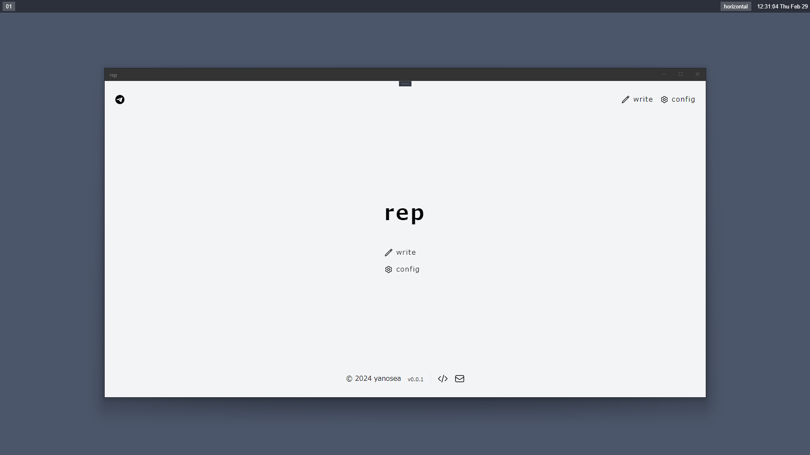
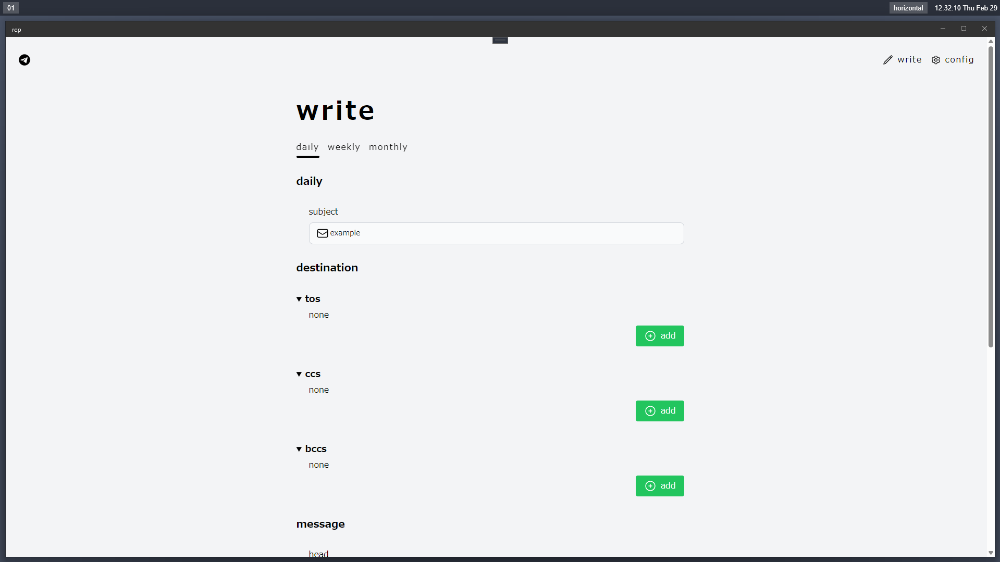
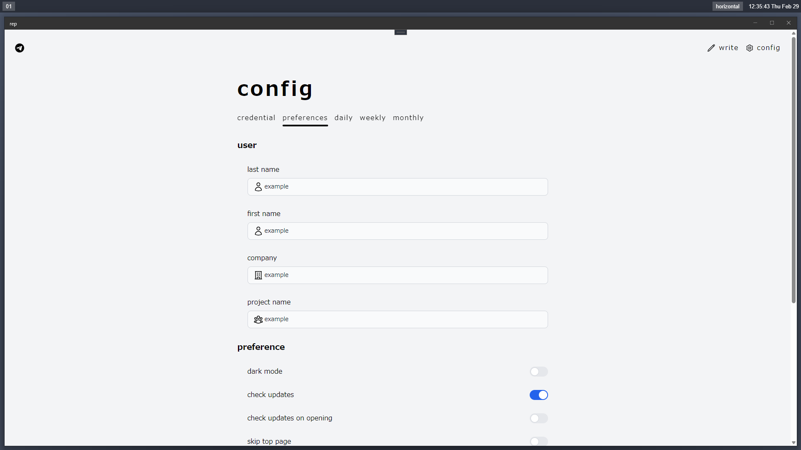

README.md in Japanese [here](https://github.com/yanosea/rep/blob/main/README_ja.md).

# 💌 rep

rep makes your reporting easier.







## ℹ️ About

`rep` is a mailer specialized for sending.

You can send daily (opening / closing), weekly, monthly reports via `rep`.

You can attache some files (ex. attendance sheet in Excel) in weekly and monthly .

## 🧩 Requirements

- Please install [Git for Windows](https://gitforwindows.org).

## 🚨 Notes

- Ensure that you have set yourself as a BCC recipient and confirm that emails are sent correctly.
- I do not take any responsibility for any losses, damages, or disadvantages arising from the use of this tool.

## 💻 OS

Although this product use .NET MAUI, only Windows is supported...😢

rep will support any platforms someday...💪

## 💿 Installation

Download and run [rep-installer.exe](https://github.com/yanosea/rep/raw/main/rep-installer/rep-installer.exe).

## ✨ Update

### 🤖 Automatically

rep can check updates via github. (You can disable it in config.)

### 🔧 Manually

Download and run any version of the installer from the download link on the [release page](https://github.com/yanosea/rep/releases).

## ⚙️ Configuration

### REP_DIR

 `REP_DIR` contains some folders.

- `.cache`
  - `.cache` is used for sending reports attached some files. So-called working directory.
- `config`
  - `config` is used for config files. You can change config by editing config files directly.
- `logs`
  - `logs` is used for rep logs. Error logs are output in `logs/errorlogs`.
- `reports`
  - `reports` is used for saving reports as text files and sqlite db file.

The default value of `REP_DIR` is your user profile (ex. `C:\Users\yanoseai\rep`).

First, it is recommended to change the value of `REP_DIR` in `rep.dll.config` in the directory where rep was installed.

```
<?xml version="1.0" encoding="utf-8" ?>
<configuration>
  <appSettings>
    <add key="REP_DIR" value="C:\Users\yanosea\rep" />
  </appSettings>
</configuration>
```

### Config Files

You can change all configs using rep or editing config files.

Config files are `.toml`.

- `.cred.toml`
  - `cred` is config for your mail account.
    - `account`
      - `mailaddress`
        - Mailaddress used for sending reports.
      - `password`
        - Password for mail account.
    - `smtp`
      - `smtp_server`
        - SMTP server for sending mails.
      - `smtp_port`
        - SMTP port for sending mails.
- `preferences.toml`
  - `preferences` is preferences for rep.
    - `user`
      - `first_name`
        - First name of you.
      - `last_name`
        - Last name of you.
      - `company`
        - Company name of you working.
      - `project_name`
        - Project name of you joining.
    - `preference`
      - `dark_mode`
        - `true` : Enable dark mode in rep.
        - `false` : Disable dark mode in rep.
      - `check_updates`
        - `true` : Enable check updates when starting rep.
        - `false` : Disable check updates when starting rep.
      - `check_updates_on_opening`
        - `true` : Enable check updates when starting rep before threshold time.
        - `false` : Disable check updates when starting rep before threshold time.
      - `skip_top_page`
        - `true` : Enable skipping top page.
        - `false` : Disable skipping top page.
      - `confirm_before_send`
        - `true` : rep will show confirm dialog when you push send button.
        - `false` : rep will not show confirm dialog when you push send button.
      - `save_text_file`
        - `true` : Enable saving contents of each report you send to text files.
        - `false` : Disable saving contents of each report you send to text files.
      - `save_destination`
        - `true` : Enable saving destination of each report you send.
        - `false` : Disable saving destination of each report you send.
      - `add_date_to_attached_file`
        - `true` : Enable adding date to attached files.
        - `false` : Disable adding date to attached files.
      - `exit_after_send`
        - `true` : Enable exitting rep after you send reports.
        - `false` : Disable exitting rep after you send reports.
- `log_conf.toml`
  - `normal_log` is config for normal log.
  - `error_log` is config for error log.
- `report`
  - `report` is config for each report.
    - `daily_conf.toml`
      - `preferences`
        - `threshold_time`
          - Threshold time to report opening or closing.
        - `interval_minutes`
          - Interval minutes of the project you joining.
        - `time_format`
          - Format used by calculating work time. You must add parameters below.
            - `%from%`
              - `%from%` will be replaced time you sent opening.
            - `%to%`
              - `%to%` will be replaced time you opened rep.
            - `%worktime%`
              - `%worktime%` will be replaced work time calculated by rep.
      - `daily_templates`
        - Templates are used for subject, head, or foot of each report.
        - You can add parameters. Parameters are explained later.
    - `weekly_conf.toml`
      - `weekly_templates`
        - Templates are used for subject, head, or foot of each report.
        - You can add parameters. Parameters are explained later.
    - `monthly_conf.toml`
      - `monthly_templates`
        - Templates are used for subject, head, or foot of each report.
        - You can add parameters. Parameters are explained later.
- `dest`
  - `dest` is config for report destination. You can configure destination on a report-by-report basis.(daily / weekly / monthly)

## 📝 Parameters

You can add parameters below to templates of each report config.

- firstname
  - `%firstname%` will be replaced first name you configured in preferences.
- lastname
  - `%lastname%` will be replaced last name you configured in preferences.
- company
  - `%company%` will be replaced company you configured in preferences.
- projectname
  - `%projectname%` will be replaced project you configured in preferences.
- today
  - `%today%` will be replaced the date you open rep.
- thismonth
  - `%thismonth%` will be replaced the month of the date you open rep.

## 🔢 Command Line Arguments

rep accepts command-line arguments.

The values that can be used as command-line arguments are as follows:

- First argument.
  - 0: Disable the daily page at startup.
  - 1: Enable the daily page at startup.
- Second argument
  - 0: Disable the weekly page at startup.
  - 1: Enable the weekly page at startup.
- Third argument
  - 0: Disable the monthly page at startup.
  - 1: Enable the monthly page at startup.

If there are not exactly three command-line arguments or if values other than 0 or 1 are specified, rep will not start.

If no command-line arguments are specified, rep will start with only the daily page enabled.

It is recommended to create and use shortcuts as follows:

- Shortcut for daily reports (command-line arguments : `1, 0, 0`)
- Shortcut for daily and weekly reports for use every weekend (command-line arguments : `1, 1, 0`)
- Shortcut for daily and monthly reports for use at the end of each month (command-line arguments : `1, 0, 1`)

## 📃 License

[🔓MIT](./LICENSE)

## 🖊️ Author

[🏹yanosea](https://github.com/yanosea)

## 🤝 Contributing

Please feel free to point me in the right direction🙏
