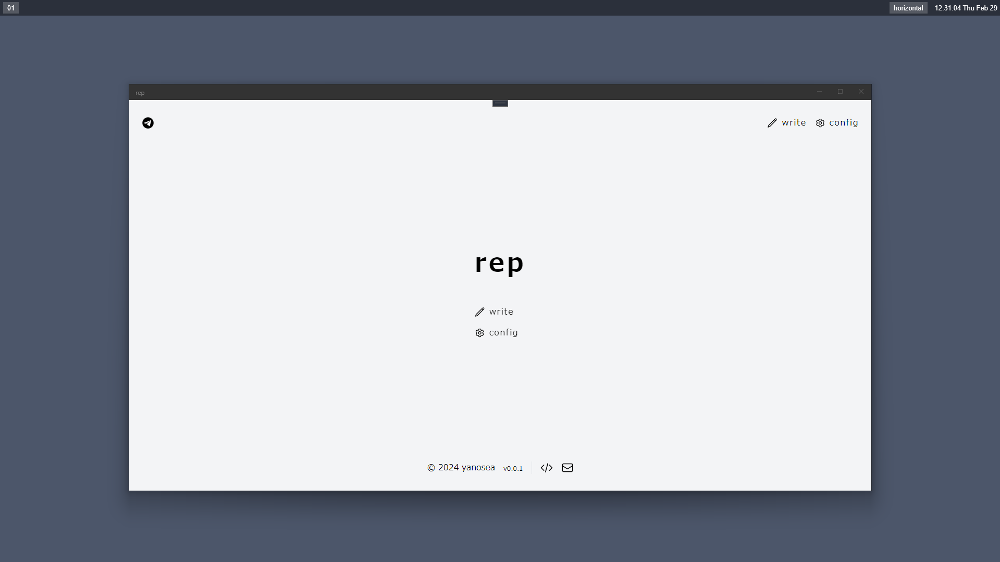
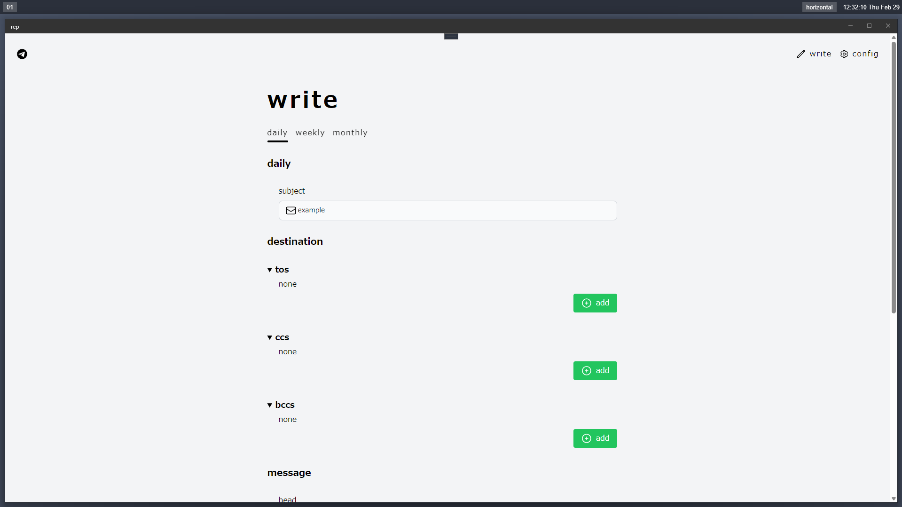

README.md in English [here](https://github.com/yanosea/rep/blob/main/README.md).

# ⚠ 警告

このアプリケーションは同僚向けに作成されたものです。

<div align="center">

# 💌 rep

</div>

rep はあなたの報告業務の手助けをします。






## ℹ️ rep について

`rep` は送信に特化したメーラーです。

日報(始業 / 終業)、週報、月報を送信することができます。

週報と月報にはExcel形式の勤怠表など、ファイルの添付が可能です。

## 🧩 必要要件

- [Git for Windows](https://gitforwindows.org)をインストールしてください。

## 🚨 注意事項

- BCCに自分を設定してメールが正しく送信できているか確認してください。
- 本ツールを使用することで生じた損失や損害、いかなる不利益に対しても一切責任を負いません。

## 💻 OS

このプロジェクトでは .NET MAUI
を使用しているにもかかわらず、Windowsのみをサポートしています...😢

いつか他のプラットフォームもサポートします...💪

## 💿 インストール方法

[rep-installer.exe](https://github.com/yanosea/rep/raw/main/rep-installer/rep-installer.exe)をダウンロードして実行してください。

## ✨ アップデート方法

### 🤖 自動でのアップデート

rep
はgithubを経由してアップデートを自動で確認します。(設定でオフにすることも可能です。)

### 🔧 手動でのアップデート

[リリースページ](https://github.com/yanosea/rep/releases)から任意のインストーラをダウンロードして実行してください。

## ⚙️ 設定

### REP_DIR

`REP_DIR` はいくつかのフォルダを含んでいます。

- `.cache`
  - `.cache` は添付ファイル送信時に使用されます。いわゆるworkディレクトリです。
- `config`
  - `config`
    は設定ファイルに使用されます。`config`配下のファイルを直接編集して設定を変更することができます。
- `logs`
  - `logs` はログファイルが出力されます。エラーログは `logs/errorlogs`
    に出力されます。
- `reports`
  - `reports` は送信したメールの内容が保存されます。

`REP_DIR` のデフォルト値は実行ユーザーのユーザーディレクトリです。(例 :
`C:\Users\yanosea\rep`)

まず最初に、repをインストールしたディレクトリにある `rep.dll.config` の
`REP_DIR` の値を変更することを推奨します。

```
<?xml version="1.0" encoding="utf-8" ?>
<configuration>
  <appSettings>
    <add key="REP_DIR" value="C:\Users\yanosea\rep" />
  </appSettings>
</configuration>
```

### 設定ファイル

設定ファイルの直接編集か、rep の config 画面から設定の変更ができます。

設定ファイルはすべて `toml` 形式です。

- `.cred.toml`
  - `cred` はメールアカウントに関する設定です。
    - `account`
      - `mailaddress`
        - 送信元となるメールアドレスを設定してください。
      - `password`
        - メールアカウントのパスワードを設定してください。
    - `smtp`
      - `smtp_server`
        - 送信サーバを設定してください。
      - `smtp_port`
        - 送信サーバのポートを設定してください。
- `preferences.toml`
  - `preferences` は rep の環境設定です。
    - `user`
      - `first_name`
        - 姓を設定してください。
      - `last_name`
        - 名を設定してください。
      - `company`
        - 所属する会社名を設定してください。
      - `project_name`
        - 参画するプロジェクト名を設定してください。
    - `preference`
      - `dark_mode`
        - `true` : rep のダークモードを有効にします。
        - `false` : rep のダークモードを無効にします。
      - `check_updates`
        - `true` : rep 起動時のアップデート確認を有効にします。
        - `false` : rep 起動時のアップデート確認を無効にします。
      - `check_updates_on_opening`
        - `true` : 後述の `threshold_time`
          以前の起動時のアップデート確認を有効にします。
        - `false` : 後述の `threshold_time`
          以前の起動時のアップデート確認を無効にします。
      - `skip_top_page`
        - `true` : トップページのスキップを有効にします。
        - `false` : トップページのスキップを無効にします。
      - `confirm_before_send`
        - `true` : 送信ボタン押下後の送信確認を有効にします。
        - `false` : 送信ボタン押下後の送信確認を無効にします。
      - `save_text_file`
        - `true` : 送信内容をテキストファイルとして保存する機能を有効にします。
        - `false` : 送信内容をテキストファイルとして保存する機能を無効にします。
      - `save_destination`
        - `true` :
          write画面で入力した送信先を送信先設定に保存する機能を有効にします。
        - `false` :
          write画面で入力した送信先を送信先設定に保存する機能を無効にします。
      - `add_date_to_attached_file`
        - `true` : 添付ファイルの末尾に日付を付与する機能を有効にします。
        - `false` : 添付ファイルの末尾に日付を付与する機能を無効にします。
      - `exit_after_send`
        - `true` : メール送信後にrepを終了します。
        - `false` : メール送信後にrepは終了しません。
- `log_conf.toml`
  - `normal_log` 通常ログの設定です。
  - `error_log` エラーログの設定です。
- `report`
  - `report` 配下には各報告の設定ファイルがあります。
    - `daily_conf.toml`
      - `preferences`
        - `threshold_time`
          - 始業報告をするか終業報告をするかの閾となる時間を設定します。
        - `interval_minutes`
          - 所属会社およびプロジェクトの勤怠の単位を分単位で設定します。
        - `time_format`
          - 終業報告の作業時間の計算に使用されます。以下のパラメータを必ず設定してください。
            - `%from%`
              - `%from%` は始業時間に置換されます。
            - `%to%`
              - `%to%` はrepを開いた時間に置換されます。
            - `%worktime%`
              - `%worktime%` は rep によって計算された作業時間に置換されます。
      - `daily_templates`
        - 各報告の題名、ヘッダー、フッターに使用されます。
        - パラメータを設定できます。パラメータについては後述します。
    - `weekly_conf.toml`
      - `weekly_templates`
        - 各報告の題名、ヘッダー、フッターに使用されます。
        - パラメータを設定できます。パラメータについては後述します。
    - `monthly_conf.toml`
      - `monthly_templates`
        - 各報告の題名、ヘッダー、フッターに使用されます。
        - パラメータを設定できます。パラメータについては後述します。
- `dest`
  - 各報告の送信先を設定します。

## 📝 パラメータ

各テンプレートには以下のパラメータを設定できます。

- firstname
  - `%firstname%` は preferences で設定した `first_name` に置換されます。
- lastname
  - `%lastname%` は preferences で設定した `last_name` に置換されます。
- company
  - `%company%` は preferences で設定した `company` に置換されます。
- projectname
  - `%projectname%` は preferences で設定した `project_name` に置換されます。
- today
  - `%today%` は rep を起動した日付に置換されます。
- thismonth
  - `%thismonth%` rep を起動した日付の月に置換されます。

## 🔢 コマンドライン引数

rep はコマンドライン引数を受け付けます。

コマンドライン引数で使用できる値は以下のとおりです。

- 第一引数
  - 0： 起動時にDailyページを無効化する
  - 1： 起動時にDailyページを有効化する
- 第二引数
  - 0： 起動時にWeeklyページを無効化する
  - 1： 起動時にWeeklyページを有効化する
- 第三引数
  - 0： 起動時にMonthlyページを無効化する
  - 1： 起動時にMonthlyページを有効化する

コマンドライン引数が3つでない場合、0、または1以外を指定した場合は rep
は起動しません。

コマンドライン引数を指定しない場合、dailyページのみ有効化された状態で起動します。

以下のようなショートカット作成・運用を推奨します。

- 毎日使用する日報のみ有効化したショートカット(コマンドライン引数 : `1, 0, 0`)
- 毎週末使用する日報と週報を有効化したショートカット(コマンドライン引数 :
  `1, 1, 0`)
- 毎月末使用する日報と月報を有効化したショートカット(コマンドライン引数 :
  `1, 0, 1`)

## 📃 ライセンス

[🔓 MIT](./LICENSE)

## 🖊️ 作者

[🏹 yanosea](https://github.com/yanosea)

## 🤝 コントリビュート

ご遠慮なくご指摘ください🙏
